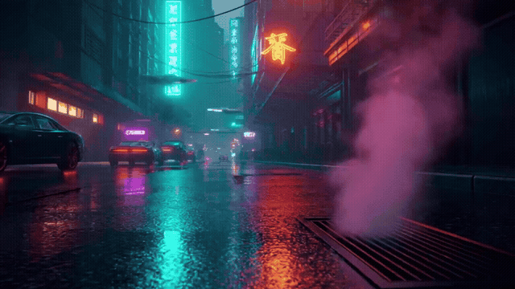

# 🎬 AI Video Generator

Веб-приложение и Telegram-бот для генерации коротких AI-видео через [proxyapi.ru](https://proxyapi.ru) — без VPN, оплата в рублях.



---

## ✨ Возможности

- **Несколько моделей** — Sora 2, Veo 3 Fast, Veo 3.1 и другие
- **Выбор длительности и соотношения сторон** прямо в интерфейсе
- **Цены в рублях** — видно стоимость до генерации
- **Telegram-бот** — генерация прямо из мессенджера
- **Polling статуса** — страница сама обновляется, когда видео готово

---

## 💰 Цены (proxyapi.ru)

| Модель | Цена | 4 сек | 8 сек |
|--------|------|-------|-------|
| **Sora 2** | **27 ₽/сек** | ~108 ₽ | ~216 ₽ |
| Veo 3 Fast | 43 ₽/сек | ~172 ₽ | ~344 ₽ |
| Veo 3.1 Fast | 43 ₽/сек | ~172 ₽ | ~344 ₽ |
| Veo 3.1 | 95 ₽/сек | ~380 ₽ | ~760 ₽ |

> Sora 2 — самая доступная модель. Поддерживает 4, 8 и 12 секунд.

---

## 🚀 Быстрый старт

### 1. Клонировать репозиторий
```bash
git clone https://github.com/ВАШ_НИКНЕЙМ/video_generate.git
cd video_generate
```

### 2. Установить зависимости
```bash
pip install -r requirements.txt
```

### 3. Настроить `.env`
```bash
cp .env.example .env
```
Откройте `.env` и вставьте ключ от [proxyapi.ru](https://console.proxyapi.ru):
```env
API_KEY=ваш_ключ
DEFAULT_MODEL=sora-2
DEFAULT_DURATION=4
```

### 4. Запустить
```bash
# Веб-интерфейс → http://localhost:5000
python app.py

# Или Telegram-бот
python bot.py
```

---

## 🗂 Структура проекта

```
video_generate/
├── app.py           # Flask веб-приложение
├── bot.py           # Telegram-бот
├── request.py       # API-клиент (Sora / Veo)
├── config.py        # Модели и цены
├── templates/
│   └── index.html   # Веб-интерфейс
├── .env.example
└── requirements.txt
```

---

## 🔧 Технологии


---

## 📡 API эндпоинты

| Метод | Путь | Описание |
|-------|------|----------|
| `GET` | `/` | Веб-интерфейс |
| `POST` | `/generate` | Запустить генерацию |
| `GET` | `/status/<task_id>` | Статус задачи |
| `GET` | `/download/<video_id>` | Скачать видео Sora |
| `GET` | `/models` | Список моделей |

### Пример запроса
```bash
curl -X POST http://localhost:5000/generate \
  -H "Content-Type: application/json" \
  -d '{
    "prompt": "A cat walking on a beach at sunset, cinematic",
    "model": "sora-2",
    "duration": 4,
    "aspect_ratio": "16:9"
  }'
```
```json
{
  "task_id": "video_abc123",
  "model": "Sora 2",
  "duration": 4,
  "estimated_cost": 108
}
```
